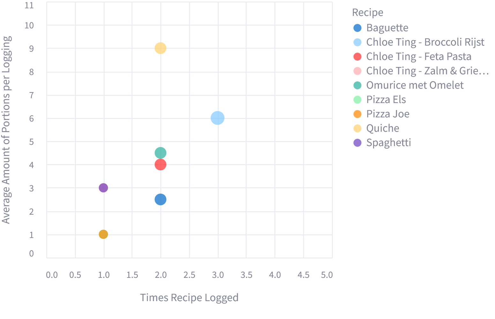
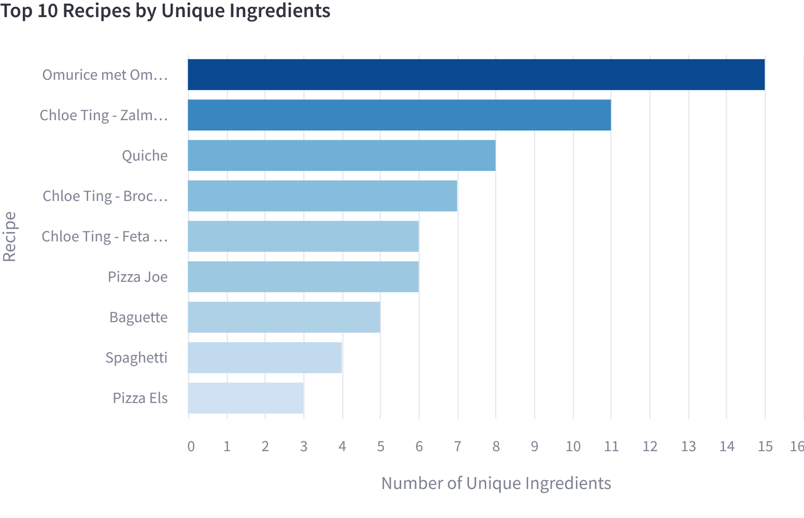
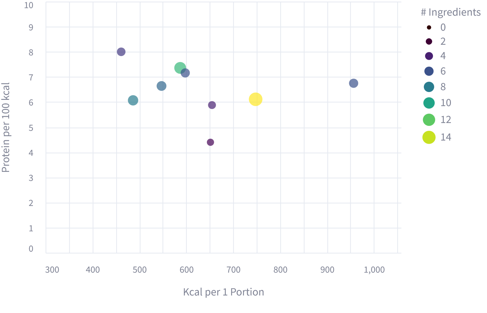
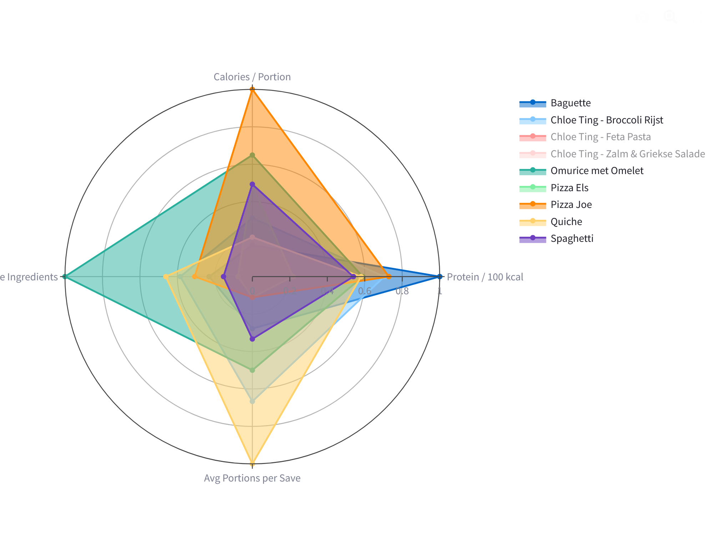

# Overview
Look at my app at: [Grocery List Els](https://grocerylistels.streamlit.app/)

Welcome to my project of weekly groceries. This project was created out of a desire to save time creating a weekly list and to be able to get insight into our weekly groceries. We are interested in nutritious diets and have formulated our standard recipes with their default ingredient lists for one portion.

Every week we decided what recipes we will have and how many portions of each we need. We then make our grocery list and add extra ingredients. This was very time consuming and almost never deviates. During the period that we did this manually every week, I started wondering what recipes did we favor, what were the exact nutritional values, how many kcal , ... . 

In a first tab there is the practical application that makes a grocery list. At the end of the page this can be exported to excel.
This list is then used to do our groceries, but is also written away in a log file which I use in the second tab.

The second tab is the analysis of all data logged through exporting each grocery list in the first tab. Only 1 export a day is allowed. The last export of that day overwrites the previous export of that day.

I also scraped nutritional data from Colruyt to make sure the kcal and protein (the 2 values I'm focussing on) were up to date. If these values were not present or the site was not available for an ingredient, manual input was provided.

# The Questions
Below are the questions I want to answer in my project:

1. What are the most used recipes?
2. Is there a type of recipe that is more popular?
3. Does the amount of ingredients used in a recipe influence how many times this recipe is logged?
4. How do recipes with a lower kcal/portion compare to recipes with a higher kcal/portion?
5. Is there an overall tendency in the recipes to one of these factors? 
- Protein per 100 kcal
- Calories per portion
- Number of unique ingredients
- Average portions per save


# Tools I Used
For my deep dive into my groceries data, I harnessed the power of several key tools:

- **Python:** The backbone of my analysis, allowing me to analyze the data and find critical insights.I also used the following Python libraries:
    - Pandas Library: This was used to analyze the data.
    - Plotly Library: I visualized the data.
    - Altair Library: Helped me create more advanced visuals.
    - Selenium Library: Allowed me to scrape nutritional data from Colruyt site.
    - bs4 Library: To get data from the website
    - Streamlit Library: Used this for a simple, free UI so this tool can be used online.
- **Jupyter Notebooks:** The tool I used to run my Python scripts which let me easily include my notes and analysis.
- **Visual Studio Code:** My go-to for executing my Python scripts.
- **Git & GitHub:** Essential for version control and sharing my Python code and analysis, ensuring collaboration and project tracking.

# Structure & Flow
## Structure
The data of Ingredients and Recipes are stored in [data.xlsx](Grocery_list\Excel_files\data.xlsx).
This data is uploaded on each reload of Streamlit.

When data is exported in Grocery List Maker, this is exported into a folder [Export](Grocery_list\Excel_files\Export) with the export date in the filename.
Subsequently, the exported data is added into the log file in [Grocery_List_Log.xlsx](Grocery_list\Excel_files\Log\Grocery_List_Log.xlsx) for further Data Analysis.


In [main.py](Grocery_list\main.py) I've assembled all functions and class definitions needed for Grocery List Maker, the handling of Ingredient and Recipe.
Also the data of Recipes and Ingredients are loaded at the end of this file.
In this main, the file [colruyt_scraper.py](Grocery_list\Colruty_scraping\colruyt_scraper.py) is used to scrape the nutritional data from the Colruyt site. I focus on the kcal and protein values.

This main file loaded as a module into the [streamlit_app.py](./streamlit_app.py).

[streamlit_app.py](./streamlit_app.py) takes care of the Streamlit UI.


## Data Recipes & Ingredients
All possible recipes and ingredients are in a data file: [data.xlsx](Grocery_list\Excel_files\data.xlsx). Only ingredients from sheet 2 can be added in sheet 1.
- Sheet 1 contains all recipes with their respective ingredients, amounts and units. 
- Sheet 2 contains all ingredients with their respective gramPerUnit, url (used to scrape nutritional data), kcal_100g, prot_100g and priceurl (to be implemented)

All logged recipes and ingredients are stored in [Grocery_List_Log.xlsx](Grocery_list\Excel_files\Log\Grocery_List_Log.xlsx). This is later used in the Data Analysis tab.

## Streamlit - Initialization
On each reload of streamlit the data of recipes, ingredients and log from these files, is reloaded.

## Streamlit - Use
### Grocery List Maker
The first tab is the practical application of my project.

You are able to choose a recipe and its portions through an expander. The accumulated selected data of these recipes is then shown at the bottom of the page. 
- All Ingredients: Shows a summary per ingredient, concerning all selected recipes and extra ingredients
- Per Recipe: Shows a summary per recipe

In the sidebar the user can choose between different functionalities:
- Suggestions of recipes according to focus
- Adding extra ingredients:
    - Extra Ingredients are also accumulated in the tab All Ingredients below
    - In the dropdown for Extra Ingredients, an ingredient can have a symbol ⭐ next to its label. This indicates that this ingredient is a current seasonal ingredient
    - To delete an extra ingredient the user must click on the trash can twice.
- Display Options is used to decide to export the data to Excel. 
    - If "Export to Excel" is chosen, the button becomes available to download.  
    - This exports the information to a file in the folder Grocery_list\Excel_files\Export with the date included in its filename. 
    - The info in All Ingredients is exported into sheet Combined and Per Recipe is exported into sheet PerRecipe in 1 single excel-file.
    - On clicking the download button, the info from All Ingredients is added to the log file.
    - If on the same day an export is performed multiple times, it will overwrite the previous data of that day.

### Data Analysis
This second tab is all about the data. 

There are 10 visualizations, each in their own expander.
In the sidebar user has default checkbox All Dates checked. If this is unchecked, date filters that work over all visualisations become available. 
- Year
- Month
- Date

At the bottom there are 3 tabs:
- Recipes by date: An expander per date were you can view wich recipes and how many portions were logged
- Combined by date: An expander per date with all ingredients logged for that date (recipes & extra ingredients)
- Sum of all ingredients for all dates: Table with all ingredients logged for all dates (recipes & extra ingredients)

Per visualisation the user can choose to see the raw data next to the visualisation.

When recipes are involved, the default is that all recipes are selected. However, by unchecking the checkbox and choosing one or more recipes, the user can personalize this.

For some there has been a slider provided to choose the top recipes, or ingredients, to make the first default view more clean.


# Data Preparation and Cleanup
This section outlines the steps taken to prepare the data for analysis, ensuring accuracy and usability.

## Import & Clean Up Data
I start by importing necessary libraries and loading the data.xlsx file, followed by initial data cleaning tasks to ensure data quality.

```python
# Importing Libraries
import streamlit as st
import pandas as pd
import os
import io
from main import * #RecipeDict, IngredientDict, get
from datetime import date, datetime
import altair as alt
import plotly.graph_objects as go
import networkx as nx
from itertools import combinations
from collections import Counter
import random  
from Colruty_scraping.colruyt_scraper_price import *


# Loading Data in main for grocery list maker
load_data_from_excel("Grocery_list\Excel_files\data.xlsx")
# Loading Data in streamlit_app for data analysis
log_file_path = "Grocery_List/Excel_files/Log/Grocery_List_Log.xlsx"
df_combined_log = pd.read_excel(log_file_path, sheet_name="Log Combined")
df_per_recipe_log = pd.read_excel(log_file_path, sheet_name="Log Per Recipe")

# Data Cleanup
# Make sure ExportDate is in date format
df_log_combined["ExportDate"] = pd.to_datetime(df_log_combined["ExportDate"])
df_log_per_recipe["ExportDate"] = pd.to_datetime(df_log_per_recipe["ExportDate"])

# Normalize Key and get Labels
f_df_per_recipe['IngredientLabel'] = f_df_per_recipe['Ingredient']
f_df_per_recipe['IngredientKey'] = f_df_per_recipe['IngredientKey'].str.strip().str.upper().str.replace(" ","", regex=False)
f_df_per_recipe['RecipeKey'] = f_df_per_recipe['Recipe'].str.strip().str.upper()
f_df_per_recipe['RecipeLabel'] = f_df_per_recipe['Recipe'].map(getRecipeLabel)

f_df_combined['IngredientKey'] = f_df_combined['Ingredient'].str.strip().str.upper().str.replace(" ","", regex=False)
f_df_combined['IngredientLabel'] = f_df_combined['Ingredient'].map(lambda r: IngredientDict[r].getLabel() if r in IngredientDict else r)

        
```

## Prepare Data for Analysis
To focus my analysis on recipes and ingredients, certain values need to be created, inserted. Such as Year, Month, Kcal, ...
```python

# Create Date Columns
df_log_combined["DateOnly"] = df_log_combined["ExportDate"].dt.date
df_log_combined["Year"] = df_log_combined["ExportDate"].dt.year
df_log_combined["MonthNum"] = df_log_combined["ExportDate"].dt.month
df_log_combined["MonthName"] = df_log_combined["ExportDate"].dt.strftime("%b")

df_log_per_recipe["DateOnly"] = df_log_per_recipe["ExportDate"].dt.date
df_log_per_recipe["Year"] = df_log_per_recipe["ExportDate"].dt.year
df_log_per_recipe["MonthNum"] = df_log_per_recipe["ExportDate"].dt.month
df_log_per_recipe["MonthName"] = df_log_per_recipe["ExportDate"].dt.strftime("%b")

# Get Unique Dates
unique_dates = sorted(df_log_combined["DateOnly"].unique(), reverse=True)

# Copy Dataframes (always keep the original)
f_df_combined = df_log_combined.copy()
f_df_per_recipe = df_log_per_recipe.copy()

# Get Category per Ingredient
f_df_per_recipe["Ingredient_Cat"] = f_df_per_recipe["Ingredient"].apply(categorize_ingredient)


```

# The Analysis
## 1. What are the most used recipes?
To find the most used recipes, I plotted per recipe over time how many portions were logged at each export.

View my python file with detailed steps here: [streamlit_app.py](./streamlit_app.py).

### Visualize Data
```python
# Base chart elements
base = alt.Chart(recipe_ts_padded).encode(
    x=alt.X("DateOnly:T", title="Date"),
    y=alt.Y("Portion:Q", title="Portion"),
    color=alt.condition(
    selection, 
    alt.Color("RecipeLegend:N", 
            scale=alt.Scale(domain=recipe_ts_padded["RecipeLegend"].dropna().unique().tolist()),
            legend=alt.Legend(title="Recipe")), 
    alt.value("lightgray")
    ),
    opacity=alt.condition(selection, alt.value(1), alt.value(0.1))
).add_params(selection)

# Line chart
lines = base.mark_line().transform_filter(selection)

# Points
points = base.mark_point(filled=True, size=80).transform_filter(selection)

# Create selection for tooltip hover
hover = alt.selection_point(on="mouseover", 
                    nearest=True, 
                    fields=["DateOnly", "Portion"], 
                    empty="none")

# Voronoi overlay: transparent selector to show tooltip when hovering overlapping points
voronoi = alt.Chart(recipe_ts_filtered).mark_circle(opacity=0).encode(
    x=alt.X("DateOnly:T", title="Date"),
    y="Portion:Q"
).add_params(hover)

# Generate an offset for each label so they don't overlap
tooltip_data = recipe_ts_filtered.copy()
tooltip_data["RowOffset"] = (
    tooltip_data
    .groupby(["DateOnly", "Portion"])
    .cumcount()
)
# Multiply by factor for spacing value
tooltip_data["dy_offset"] = tooltip_data["RowOffset"] * 15
tooltips = []

for offset in tooltip_data["RowOffset"].unique():
    subset = tooltip_data[tooltip_data["RowOffset"] == offset]
    label = alt.Chart(subset).transform_filter(
    hover
    ).transform_filter(selection).mark_text(
    align="left",
    dx=10,
    dy=int(offset * 15)  # STATIC number only
    ).encode(
    x=alt.X("DateOnly:T"),
    y="Portion:Q",
    text=alt.Text("RecipeLabel:N"),
    tooltip=[
        alt.Tooltip("DateOnly:T", title="Date"),
        alt.Tooltip("RecipeLabel:N", title="Recipe"),
        alt.Tooltip("Portion:Q", title="Portion")
    ]
    )
    tooltips.append(label)

chart = (lines + points + voronoi + alt.layer(*tooltips)).interactive().properties(height=400)

# Display chart and optionally the table
if viewTable == 'Yes':
    col1, col2 = st.columns([3, 2])
    with col1:
        st.altair_chart(chart, use_container_width=True)
        st.write(caption)#st.caption(f'Select ingredients from dropdown above. Hover for details.')
    with col2:
        recipe_ts_filtered["DateOnly"] = pd.to_datetime(recipe_ts_filtered["DateOnly"]).dt.strftime('%B %d, %Y')
        st.dataframe(recipe_ts_filtered.rename(columns={'RecipeLabel':'Recipe','DateOnly': 'Date'}).set_index("Recipe"), use_container_width=True)

else:
    st.altair_chart(chart, use_container_width=True)
    st.write(caption)#st.caption(f'Select ingredients from dropdown above. Hover for details.')
```
### Results


*Line graph visualizing the amount of portions for each recipe.*
### Insights
- As this data will keep evolving, these insights are only of this moment in time. To make a more valid impression, more data will need to be collected.
- Some recipes are often chosen, though their portions fluctuate, the fact that they are chosen is more or less constant : Quiche
- Others are not always chosen, but when chosen, the portions are larger : Omurice met Omelet
- There is a difference between frequency (how often is a recipe chosen) and portions (how much of the recipe is made). Further analysis is necessary to take this distinction into account.

## 2. Is there a type of recipe that is more popular?
Going further on the insights from the previous question, is there a way to see which recipe is more popular?
With this we need to take into account: 
- the frequency (how often is the recipe chosen), 
- the average amount of portions per export
- and amount of ingredients used in 1 portion

View my python file with detailed steps here: [streamlit_app.py](./streamlit_app.py). 

### Visualize Data
``` python
chart = alt.Chart(filtered_recipes_result).mark_circle(size=100).encode(
x=alt.X("TimesLogged:Q", 
    title="Times Recipe Logged",
    scale=alt.Scale(domain=[0, max_x + 1])),
y=alt.Y("AvgPortionsPerSave:Q", 
    title="Average Amount of Portions per Logging",
    scale=alt.Scale(domain=[0, max_y + 1])),
tooltip=[   alt.Tooltip("RecipeLabel:N", title="Recipe"),
        alt.Tooltip("TimesLogged:Q", title="# Times Logged"),
        alt.Tooltip("AvgPortionsPerSave:Q", title="Avg Portions / Logging")],
color=alt.Color("RecipeLabel:N", legend = alt.Legend(title="Recipe")),
size=alt.Size("TimesLogged:Q", scale=alt.Scale(range=[50, 300]), legend=None)

    ).properties(
width=700,
height=400
).interactive()
    
# View table option
viewTable = st.radio("View data in table?", ["No", "Yes"], key='Visual4')
if viewTable == 'Yes':
    col1, col2 = st.columns([3, 2])
    # Visual
    with col1:
        st.altair_chart(chart, use_container_width=True)
        st.write(caption)
    # Data table
    with col2:
        filtered_recipes_result.rename(columns={'TimesLogged':'Times Recipe Logged', 'AvgPortionsPerSave':'Average # of Portions / Logging'}, inplace=True)
        st.dataframe(filtered_recipes_result.rename(columns={'RecipeLabel':'Recipe'}).set_index("Recipe"), use_container_width=True)
else:
    st.altair_chart(chart, use_container_width=True)
    st.write(caption)
```
### Results


*Plot graph visualizing the correlation between the frequency - average amount of portions - amount of ingredients*


*Plot graph visualizing the correlation between the frequency - average amount of portions*

### Insights:
- The recipes with least amount of unique ingredients are not chosen more than ingredients with more ingredients. This does not seem to influence the popularity much.
- Although Omurice met Omelet has the most ingredients, it is still chosen more than recipes with less ingredients.
- The recipe with the most average portions per save is Quiche(9). 
- If we take the previous line graph into account with this, then Quiche is a recipe that is, on the whole, mostly chosen. And the average portion is larger than the other recipes. A case can be made that Quiche is the most popular.
- On the other hand, Chloe Ting - Broccoli Rijst is the most frequently chosen (3), as you can see on this graph. But is not as constant as Quiche (2), if you take the previous graph into consideration.
- While Chloe Ting - Broccoli Rijst is the most frequently chosen (3), and has a high average portion (6), it is not as consistent as Quiche. Therefore I would argue that Quiche is the most popular recipe.

## 3. Does the amount of ingredients used in a recipe influence how many times this recipe is logged?
In the last question there didn't seem to be a correlation between the amount of unique ingredients per recipe and how many times it was chosen or the average amount of portions. But I want to examine this a bit further.

View my python file with detailed steps here: [streamlit_app.py](./streamlit_app.py).

### Visualize Data
```python
# Optional: limit number of recipes shown
top_n = st.slider("Select how many top recipes to show", min_value=5, max_value=30, value=10, step=1, key = 'slider_uniq_ingr_per_recipe')
top_recipes_df = unique_ingredients_df.head(top_n)

# Bar chart with Altair
chart = alt.Chart(top_recipes_df).mark_bar().encode(
    x=alt.X("UniqueIngredients:Q", title="Number of Unique Ingredients"),
    y=alt.Y("RecipeLabel:N", sort='-x', title="Recipe"),
    tooltip=[alt.Tooltip("RecipeLabel:N"), alt.Tooltip("UniqueIngredients:Q")],
    color=alt.Color("UniqueIngredients:Q",
            scale=alt.Scale(scheme='blues'),
            legend=None)
).properties(
    width=700,
    height=40 * top_n,
    title=f"Top {top_n} Recipes by Unique Ingredients"
)

viewTable = st.radio("View data in table?", ["No", "Yes"],key='Visual8')
if viewTable =='Yes':
    col1, col2 = st.columns([3,2])
    # Visual
    with col1:
        st.altair_chart(chart, use_container_width=True)
        st.write(caption)
    # Data table
    with col2:
        st.dataframe(top_recipes_df.rename(columns={'RecipeLabel':'Recipe','UniqueIngredients':'# Unique Ingredients'}).set_index("Recipe"), use_container_width=True)
else:
    st.altair_chart(chart, use_container_width=True)
    st.write(caption)
```


*Bar graph of top recipes with most unique ingredients*

### Insights
- The recipe with the most ingredients is Omurice met Omelet (15).
- While Quiche (8) is in the top 3, from the previous questions it would seem that altough Quiche has many ingredients (compared to all recipes) that doesn't determine its popularity.
- Chloe Ting - Broccoli Rijst (7) follows Quiche and completes the top 4 recipes. And this was the other recipe that could be argued as being the most popular recipe. 
- Although the 2 most popular dishes are in the top 4 and thus you might tend to think amount of ingredients does not influence the frequency, I would argue against this. The top recipe has 15 ingredients, with is almost the double of n° 3 (8) and more than double than n° 4 (7).
- While the 2 most popular recipes are in the top in this graph, there is a large gap between their amount of ingredients and that of the top recipe. I tend to say that recipes with larger amounts of ingredients tend to have a lower frequency.
- But what of the recipes with less ingredients? These don't seem to be popular when you take previous graphs into account.

## 4. How do recipes with a lower kcal/portion compare to recipes with a higher kcal/portion?
To further analyse why recipes with less ingredients don't seem more popular, other indicators must be taken into account. Next step is to look at the kcal / portion of a recipe and the amount of protein per 100 kcal.

View my python file with detailed steps here: [streamlit_app.py](./streamlit_app.py).

### Visualize Data
```python
chart = alt.Chart(filtered_recipes_result).mark_circle(size=100).encode(
x=alt.X("RecipeKcal1Port:Q", title="Kcal per 1 Portion",scale=alt.Scale(domain=[300, max_x+100])),
y=alt.Y("RecipeProtPer100Kcal:Q", title="Protein per 100 kcal", scale=alt.Scale(domain=[0, max_y+1])),
size=alt.Size("UniqueIngredients:Q", title="# Ingredients",scale=alt.Scale(range=[30, 300])),
color=alt.Color("UniqueIngredients:Q", scale=alt.Scale(scheme="viridis")),
tooltip=[alt.Tooltip("RecipeLabel:N", title="Recipe"),
    alt.Tooltip("RecipeKcal1Port:Q", title="Kcal / 1 Portion"),
    alt.Tooltip("RecipeProtPer100Kcal:Q", title="Prot / 100 Kcal"),
    alt.Tooltip("UniqueIngredients:Q", title="# Ingredients")]
    ).interactive().properties(
        width=700,
        height=400
    )

viewTable = st.radio("View data in table?", ["No", "Yes"],key='VisualT6')
if viewTable =='Yes':
    col1, col2 = st.columns([3,2])
    # Visual
    with col1:
    # Plot using Altair
        st.altair_chart(chart, use_container_width=True)
        st.write(caption)
    # Data table
    with col2:
        st.dataframe(filtered_recipes_result.rename(columns={'RecipeLabel':'Recipe','RecipeKcal1Port':'Kcal 1 portion', 'RecipeProtPer100Kcal':'Prot / 100 Kcal', 'UniqueIngredients':'# Ingredients'}).set_index("Recipe"), use_container_width=True)
else:
    st.altair_chart(chart, use_container_width=True)
    st.write(caption)
```

### Results

*A radar chart that compares Protein/100kcal - Kcal/Portion - Number of Ingredients - Average Portions*

### Insights:
- While Pizza Joe does not have a lot of ingredients (6), it does have a high count of kcal per 1 portion (956.69).
- Pizza Els has a low count of ingredients (3) but still has (651.59) which is higher than Quiche (486.54) and Chloe Ting - Broccoli Rijst (547.23)
- Same for Spaghetti (654.9).
- Additionally, all 3 recipes don't have a high protein amount per 100 kcal.
- It seems that also the kcal and protein distribution influences the chosen recipes.

## 5. Is there an overall tendency in the recipes to one of these factors? 
If we combine these 4 metrics of each recipe, is there a correlation that might reveal itself?
- Calories / Portion
- Protein / 100 Kcal
- Average Portions / Save
- Amount of Ingredients

View my python file with detailed steps here: [streamlit_app.py](./streamlit_app.py).

### Visualize Data
```python
categories = ["Protein / 100 kcal", "Calories / Portion", "Unique Ingredients", "Avg Portions per Save"]


fig = go.Figure()

for i, row in norm_df.iterrows():
    values = row[metrics].values.tolist()
    percentages = [f"{round(v * 100)}%" for v in values]
    raw_vals = df_selected[df_selected["RecipeLabel"] == row["RecipeLabel"]][metrics].values.flatten().tolist()
    
    hover_text = [
        f"{cat}<br>Value: {round(raw_val, 2)}<br>Normalized: {pct}<br>Recipe: {row['RecipeLabel']}"
        for cat, raw_val, pct in zip(categories, raw_vals, percentages)
    ]
                
    # Close the loop for radar
    fig.add_trace(go.Scatterpolar(
        r=values + [values[0]],
        theta=categories + [categories[0]],
        fill='toself',
        name=row["RecipeLabel"],
        text=hover_text + [hover_text[0]],
        hoverinfo='text'
    ))

# st.write(norm_df)

fig.update_layout(
polar=dict(
    radialaxis=dict(
        visible=True,
        range=[0, 1]
    ) ),
showlegend=True,
width=700,
height=600
)

viewTable = st.radio("View data in table?", ["No", "Yes"],key='VisualT9')
if viewTable =='Yes':
    col1, col2 = st.columns([3,2])
    # Visual
    with col1:
        st.plotly_chart(fig, use_container_width=True)
        st.write(caption)
    # Data table
    with col2:

        st.dataframe(norm_df.rename(columns={'RecipeLabel':'Recipe','UniqueIngredients':'# Unique Ingredients','RecipeKcal1Port':'# Kcal/Portion','RecipeProtPer100Kcal':'# Prot/100 Kcal','AvgPortionsPerSave':'Avg Portion/Logging'}).set_index("Recipe"), use_container_width=True)
else:
    st.plotly_chart(fig, use_container_width=True)
    st.write(caption)

```

### Results

*A radar chart that compares Protein/100kcal - Kcal/Portion - Number of Ingredients - Average Portions*

### Insights:
- Quiche, the most popular recipe, has the most average portions per save. Has an above average Protein/100kcal (58%), has low Calories / Portions (21%), average amount of ingredients (48%).
- The other popular recipe, Chloe Ting - Broccoli Rijst, also has a high average portions per save (67%), high Protein/100kcal (70%), low calories/portion (31%) and lower amount of ingredients (38%).
- In contrast, the least popular recipes (Pizza Els, Pizza Joe, Spaghetti, Baguette) seem to have a higher Calories / Portion (>50%).


# What I Learned
Throughout this project, I deepened my understanding of our choice selection of recipes. In addition I trained my Python skills and broadened my understanding.
- **Advanced Python Usage:** Utilizing libraries such as Pandas for data manipulation, Altair and Matplotlib for data visualization, and other libraries helped me perform complex data analysis tasks more efficiently.
- **Data Cleaning Importance:** I learned that thorough data cleaning and preparation are crucial before any analysis can be conducted, ensuring the accuracy of insights derived from the data.
- **Applying Real World Issues to Analysis:** The project emphasized the importance of using one's skills to make a solution for a real world issue and help understanding its evolution. Through making something I can use on a daily basis I deepened my understanding of my diet and Python skills.

# Insights
This project provided several general insights into our recipe choices:
- **Portions and Frequency:** Just because a recipe seems to be popular because it has a larger frequency and portions than other recipes, doesn't make it so. Some recipes are more consistent in their frequency and portion which indicates a certain level of popularity. 
- **Frequency and Amount of Ingredients:** Although I did expect it, there seems to be a correlation between the frequency of recipes and a large amount of ingredients. Recipes with higher amount of ingredients tend to be chosen less frequently.
- **Calories and protein to Frequency:** The calories and protein amount in a portion of a recipe seems to be a determining factor. If the calories / portion are >50% in comparison to other recipes, then that recipe seems to be less popular. 

# Challenges I Face
This project was not without its challenges, but it provided good learning opportunities:

- **Data Inconsistencies:** Handling missing or inconsistent data entries requires careful consideration and thorough data-cleaning techniques to ensure the integrity of the analysis.
- **Complex Data Visualization:** Designing effective visual representations of complex datasets was challenging but critical for conveying insights clearly and compellingly.
- **Balancing Breadth and Depth:** Deciding how deeply to dive into each analysis while maintaining a broad overview of the data landscape required constant balancing to ensure comprehensive coverage without getting lost in details.
- **Quality & Quantity of Data** There hasn't been enough time for data collection, so present analysis is incomplete and should be taken with a grain of salt. This can be a starting point, but further analysis is necessary when more registrations have been made.
- **Focus** The focus of this project analysis was on popularity with a special interest in the calories and protein amount for each recipe. These are important factors, but don't give the entire analysis. Again, this is a starting point, but other factors should be included in further analysis (price, ingredient category, fiber, sugar, ... )

# Conclusion
This exploration into my diet has been incredibly informative. The insights I got enhance my understanding and provide guidance for further analysis. This project is a good foundation for future explorations and underscores the importance of continuous learning and adaptation. Further features may include price analysis, ingredient category analysis to give a more complete and global overview.
